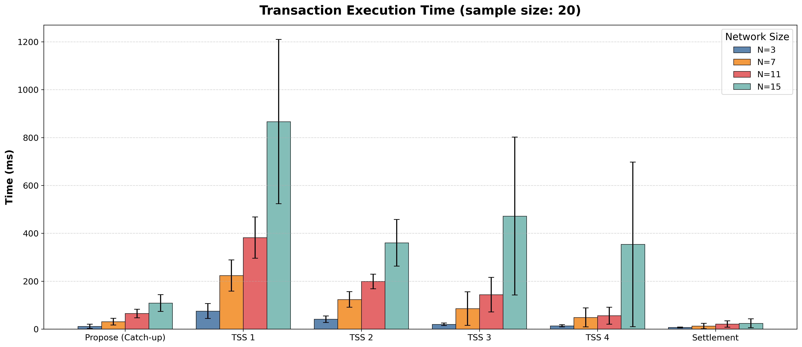
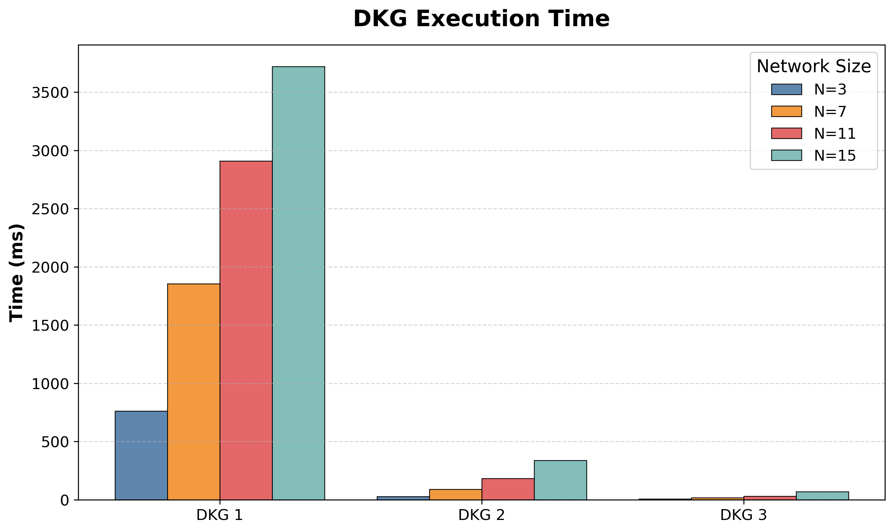

_This is a part of my Bachelor's thesis. [Nguyen Huu Thuan](mailto:snowyfield1906@gmail.com), [University of Science - VNUHCM](https://en.hcmus.edu.vn/) (2026)._

- [tss-node](https://github.com/SnowyField1906/tss-node)
- [tss-orchestrator](https://github.com/SnowyField1906/tss-orchestrator)
- tss-node-p2p (current)

# Thesis Abstraction

## Design objectives

1. **Verifiability**: Any _falsified/corrupted information_ a node receives from the Orchestrator server or other peer nodes can be _independently verified_. However, this comes at the cost of not guaranteeing the availability of the service if the Orchestrator server intentionally delays or provides falsified/corrupted information.

2. **Byzantine fault tolerance**: The network is fault-tolerant up to a threshold of $t$ such that $n/2 < t \leq n$. In the most extreme case where an attacker simultaneously controls both the Orchestrator server and $t - 1$ nodes, the system must still ensure cryptographic safety, meaning it is impossible to generate a valid signature pair for any state that is fraudulent or affects the state of the remaining $t$ honest nodes.

3. **Commitment of the signature**: A transaction once signed must be _atomic and committed_. Even when $\geq t$ nodes go offline simultaneously, any transaction that has been signed and confirmed in the past can still be _unilaterally settled on-chain_ by anyone without causing a conflict or exposing a vulnerability that would freeze latest valid state by any kind of attacks.

## Optimization strategies

1. **Optimizing input throughput**: Instead of signing directly on each individual transaction, the system signs indirectly on the cumulative state of the entire fund. This strategy allows an unlimited number of micro-transactions to be aggregated off-chain into a single settlement message, maximizing throughput and reducing transaction fees to near-zero.

2. **Optimizing output throughput**: Instead of performing direct transfers at each settlement, the Smart Contract adopts a proactive pull-model.

3. **Optimizing data structure and blockchain costs**: Instead of having Smart Contract to update the cumulative state for each user at each settlement, the system uses a Sparse Merkle Tree approach. This strategy allows the Smart Contract to perform only a fixed $O(1)$ complexity of Merkle Root reassignment (settlement) and proof verification (fund withdrawal). Additionally, the Merkle root is optimized to just a fixed-size `32-bytes` value by precomputing the values of empty branches for all $2^{256}$ states.

4. **Optimizing consensus process and native multi-chain support**: Instead of having on-chain threshold consensus, the system moves the consensus process to an off-chain network by utilizing mathematical properties to constrain the ability to generate threshold signatures. Additionally, the off-chain consensus process naturally enables native multi-chain support.

5. **Optimizing cryptographic security**: Instead of using only a single **Feldman Verifiable Secret Sharing** phase for the Distributed Key Generation, the system adds **Pedersen Verifiable Secret Sharing** to address the waiting attack vulnerability and employs **Threshold Signature Scheme** to ensure that the fund's private key exists only mathematically but is never reconstructed anywhere in memory.

6. **Optimizing network complexity**:  Instead of using a fully distributed architecture with communication complexity of $O(n^2)$ and $O(t^2)$, the system employs a central Orchestrator server to aggregate messages, reducing complexity to linear $O(n)$ and $O(t)$ without compromising cryptographic security.

7. **Optimizing transaction finality**: Instead of having a lock-time to handle the latest state dispute, the system relies on cumulative state and one-way transaction properties to eliminate the possibility of forking or state dispute.

# TSS Node P2P (alternative architecture)

This repository contains the implementation of a participant node $\mathcal{P}_i$ in the fully decentralized distributed fund system. Each node securely holds a fractional secret polynomial share $x_i$ without exposing it to external parties.

The system implements a **Distributed Key Generation (DKG)** protocol using **Pedersen Verifiable Secret Sharing (PVSS)**, a **Threshold Signature Scheme (TSS)** based on the **GG18** specification over the `secp256k1` elliptic curve, and a **Sparse Merkle Tree (SMT)** to manage and verify users' cumulative balances.

Nodes communicate directly with each other via Peer-to-Peer RESTful API requests. For the proposed architecture, please refer to [@SnowyField1906/tss-node](https://github.com/SnowyField1906/tss-node).

## Distributed Key Generation (DKG)

The DKG process ensures that no single entity possesses the full private key. It establishes the system parameters $(t, n)$, requiring a threshold $t$ to reconstruct the original private key.

- **Broadcast Phase (`POST /dkg/broadcast`):**
  - Each node generates a secret polynomial $f(x)$ and a blinding polynomial $g(x)$ of degree $t-1$.
  - It evaluates points $s_{i,j}$ and $t_{i,j}$ for every peer $j$.
  - It generates a 1028-bit Paillier Homomorphic Encryption keypair for future additive operations.
  - It broadcasts Pedersen Commitments $C_k = f_k G + g_k H$ to allow public verification of its shares without revealing the actual values directly to all peers.
- **Receive Phase (`POST /dkg/receive`):**
  - Receives encrypted secret and noise fragments from peers via ECIES encryption. It validates the integrity of these shares against the sender's Pedersen Commitments.
  - Aggregates the validated fragments to compute its master secret share $x_i = \sum s_{j,i} \pmod q$.
  - Generates and returns Feldman Commitments $A_{i,k} = a_{i,k}G$ to prove the correctness of its derived secret share.
- **Compute Public Key Phase (`POST /dkg/compute-public-key`):**
  - Self-verifies the master share against all network Feldman commitments.
  - Reconstructs and saves the globally aggregated uncompressed public key $Y = \sum A_{i,0}$, which is used for on-chain signature verification.

## Sparse Merkle Tree (SMT)

The SMT manages and verifies users' cumulative balances. It's a data structure that allows for a fixed-size `32-byte` storage and $O(1)$ verification without scaling along with the number of users or transactions.

Before signing, a node independently calculates the impending system state using a local SMT.

- Retrieves the latest global state from peers via `GET /fund/latest-state` to ensure its `nonce` is up-to-date and to verify the old state's signature if its local replica is out of sync.
- Validates the incoming Merkle Proof of the requesting user.
- Updates the local SMT off-chain by accumulating the user's balance, computes the new Merkle Root via binary `Buffer` concatenations, and constructs the deterministic `messageHash`.
- Saves this transition to the local `PendingTransaction` collection.
- Dispatches the proposal directly to all peers via `POST /tss/propose`. The node keeps distinct `pendingTransaction` records separated by `chainId` to prevent overlapping states.

## Threshold Signature Scheme (TSS)

The TSS process is based on the GG18 protocol. It uses Homomorphic Encryption to perform operations on encrypted values, allowing $t$ nodes to collaboratively generate a valid signature without reconstructing the private key in memory.

Once a node receives $t$ identical transaction proposals, or directly acts as a proposer, the interactive GG18 signing cycle begins.

- **Start Phase (`POST /tss/start`):**
  - Generates ephemeral random scalars: nonce share $k_i$ and auxiliary masking variable $\gamma_i$.
  - Computes the subset-specific Lagrange interpolated share: $w_i = x_i \lambda_{i,S} \pmod q$.
  - Encrypts these values under its own Paillier public key: $E_i(k_i)$ and $E_i(w_i)$.
  - Proposer node directly triggers this phase on peers.
- **Multiplicative-to-Additive Phase (`POST /tss/mta`):**
  - Transforms the distributed product of secrets into a sum of shares.
  - To prevent vulnerability from negative values causing modulo wrap-around in Paillier encryption, the node applies Additive Blinding. It generates random scalars $\beta'$ and $\mu'$, stores their modulo $q$ complements ($\beta_{ij}, \mu_{ij}$), and uses Homomorphic Addition to mask the ciphertexts. This prevents numerical overflow exceeding the Paillier key length.
  - Outputs ciphertext shares $\alpha_{ij}$ (for $k\gamma$) and $\nu_{ij}$ (for $x\gamma$) to peers.
- **Delta & Sigma (`POST /tss/delta`):**
  - Decrypts the incoming masked MtA shares.
  - Computes the local additive components: $\delta_i = k_i\gamma_i + \sum(\alpha_{ji} + \beta_{ij}) \pmod q$ and $\sigma_i = k_iw_i + \sum(\nu_{ji} + \mu_{ij}) \pmod q$.
- **Sign (`POST /tss/sign`):**
  - Receives the global curve extraction $r$.
  - Evaluates the partial ECDSA signature equation: $s_i = m \cdot k_i + r \cdot \sigma_i \pmod q$.
  - Commits the transaction to the local database via atomic updates into the `Key` and `Fund` document and deletes the `PendingTransaction` to finalize the process.

## Database Schema (MongoDB)

### `Key`

Stores the fundamental cryptographic identity and persistent state across networks.

- `x_i`: The unrecoverable master secret polynomial share.
- `Y`: The globally aggregated uncompressed public key.
- `f_poly`: The generated secret polynomial coefficients.
- `paillier`: The Homomorphic Encryption keypair `{ publicKey: { n, g }, privateKey: { lambda, mu } }`.
- `chains`: A nested dictionary containing independent state tracking for multiple concurrent blockchains (`chainId` mapped to `nonce` and `root`).

### `Share`

Stores verified payload fragments received from peer nodes during the PVSS routing phase.

- `i`: The destination node index.
- `s_ij`: The verifiable secret fragment $f_j(i)$.
- `t_ij`: The verifiable noise fragment $g_j(i)$.
- `paillierPublicKey`: The peer's Paillier identity utilized during the MtA phase.

### `TssState`

Ephemeral, short-lived state storage strictly dedicated to active signing sessions.

- `messageHash`: The cryptographic identifier for the targeted transaction.
- `k_i`, `gamma_i`, `w_i`, `sigma_i`: Intermediate GG18 scalar variables isolated to this specific session.
- `betas`, `alphas`, `mus`, `nus`: Cross-routing dictionaries storing incoming and outgoing obfuscated MtA payloads.
- `starts`, `mtas`, `deltas`, `signs`: Queues to store incoming peer requests and ensure synchronization without central coordinator.

### `PendingTransaction`

Tracks transactions that have been proposed but are waiting for TSS consensus.

- `chainId`: The target blockchain.
- `newRoot`: The newly calculated Sparse Merkle Tree root.
- `newNonce`: The next sequential nonce.
- `messageHash`: The globally unique hash of the proposed state transition.

### `Fund`

Maintains the synchronized global state of users' balances across the decentralized network.

- `chainId`: The target blockchain.
- `nonce`: The sequential state number.
- `root`: The current Sparse Merkle Tree root.
- `signature`: The latest aggregated ECDSA signature securing this state.
- `balances`: Dictionary of all users' accumulated balances on the network.

## Directory Structure (NestJS)

- [`common/`](./common/)
  - [`bignumber.ts`](./common/bignumber.ts)
  - [`ecies.ts`](./common/ecies.ts)
  - [`hashes.ts`](./common/hashes.ts)
  - [`phe.ts`](./common/phe.ts)
  - [`secp256k1.ts`](./common/secp256k1.ts)
  - [`smt.ts`](./common/smt.ts)
- [`config/`](./config/)
  - [`index.ts`](./config/index.ts)
- [`controllers/`](./controllers/)
  - [`dkg.controller.ts`](./controllers/dkg.controller.ts)
  - [`fund.controller.ts`](./controllers/fund.controller.ts)
  - [`ping.controller.ts`](./controllers/ping.controller.ts)
  - [`tss.controller.ts`](./controllers/tss.controller.ts)
- [`dtos/`](./dtos/)
  - [`dkg.dto.ts`](./dtos/dkg.dto.ts)
  - [`tss.dto.ts`](./dtos/tss.dto.ts)
- [`helpers/`](./helpers/)
  - [`httpRequest.ts`](./helpers/httpRequest.ts)
- [`libs/`](./libs/)
  - [`arithmetic.ts`](./libs/arithmetic.ts)
  - [`pvss.ts`](./libs/pvss.ts)
- [`schemas/`](./schemas/)
  - [`fund.schema.ts`](./schemas/fund.schema.ts)
  - [`key.schema.ts`](./schemas/key.schema.ts)
  - [`pending-transaction.schema.ts`](./schemas/pending-transaction.schema.ts)
  - [`share.schema.ts`](./schemas/share.schema.ts)
  - [`tss-state.schema.ts`](./schemas/tss-state.schema.ts)
- [`services/`](./services/)
  - [`dkg.service.ts`](./services/dkg.service.ts)
  - [`fund.service.ts`](./services/fund.service.ts)
  - [`ping.service.ts`](./services/ping.service.ts)
  - [`tss.service.ts`](./services/tss.service.ts)
- [`test/`](./test/)
  - [`dkg.spec.ts`](./test/dkg.spec.ts)
  - [`e2e.spec.ts`](./test/e2e.spec.ts)
  - [`phe.spec.ts`](./test/phe.spec.ts)
  - [`pvss.spec.ts`](./test/pvss.spec.ts)
  - [`tss.spec.ts`](./test/tss.spec.ts)
- [`types/`](./types/)
  - [`global.d.ts`](./types/global.d.ts)

## Test Suite (Jest)

- **Paillier Homomorphic Encryption**
  - Basic encrypt/decrypt
    - [x] `should decrypt to original plaintext` (3 ms)
    - [x] `should encrypt zero correctly` (2 ms)
    - [x] `should handle large values` (2 ms)
    - [x] `should produce different ciphertexts for same plaintext (randomized)` (5 ms)
  - Additive homomorphism
    - [x] `E(a) + E(b) = E(a + b)` (3 ms)
    - [x] `sum of multiple encryptions` (6 ms)
  - Scalar multiplication
    - [x] `E(a) × k = E(a × k)` (3 ms)
    - [x] `E(a) × 0 = E(0)` (1 ms)
    - [x] `E(a) × 1 = E(a)` (3 ms)
  - MtA simulation
    - [x] `should produce correct additive shares of a product` (4 ms)
    - [x] `should work with secp256k1-order-sized values` (4 ms)
  - Cross-key operations
    - [x] `cannot decrypt with different key` (54 ms)

- **Pedersen Verifiable Secret Sharing**
  - Polynomial Operations
    - [x] `should generate polynomial of correct degree` (6 ms)
    - [x] `should evaluate polynomial correctly at x=0 (returns secret)` (1 ms)
    - [x] `should produce different values at different points` (1 ms)
  - Pedersen Commitments
    - [x] `should generate commitments matching polynomial length` (344 ms)
    - [x] `should verify valid shares against Pedersen commitments` (572 ms)
    - [x] `should reject tampered shares` (343 ms)
  - Feldman Commitments
    - [x] `should generate Feldman commitments from polynomial` (144 ms)
  - Master Share Verification
    - [x] `should verify aggregated master share against all Feldman commitments` (350 ms)

- **Distributed Key Generation (n=3, t=2)**
  - [x] `Phase 1: Each node generates polynomial, commitments, and Paillier keys` (1976 ms)
  - [x] `Phase 2: Each node receives batched shares, verifies, and returns Feldman Commitments` (1987 ms)
  - [x] `Phase 3: Nodes self-verify master shares and reconstruct public key Y` (166 ms)

- **Threshold Signature Scheme P2P (n=3, t=2)**
  - [x] `Phase 0 & 1: Nodes propose transaction and process Start Phase` (173 ms)
  - [x] `Phase 2: MtA round 1 & 2` (24 ms)
  - [x] `Phase 3: Delta + Sigma` (173 ms)
  - [x] `Phase 4: Distributed ECDSA signature and state commit` (217 ms)

- **P2P Comprehensive End-to-End (n=3, t=2)**
  - [x] `Phase 1: Any node initializes DKG and distributes keys (P2P)` (910 ms)
  - [x] `Phase 2.1: Subset (1, 2) proposes initial transaction (P2P)` (387 ms)
  - [x] `Phase 2.2: Nodes verify signature and commit state for Tx1 (P2P)` (414 ms)
  - [x] `Phase 3: Nodes reject mismatched payloads` (412 ms)
  - [x] `Phase 4.1: Subset (2, 3) proposes sequential transaction (P2P)` (408 ms)
  - [x] `Phase 4.2: Nodes verify signature and accumulate balance for Tx2 (P2P)` (373 ms)
  - [x] `Phase 5.1: Subset (1, 3) proposes transaction for new user (P2P)` (158 ms)
  - [x] `Phase 5.2: Nodes verify signature and update Merkle tree (P2P)` (370 ms)
  - [x] `Phase 6: Nodes process multi-chain proposals concurrently (P2P)` (344 ms)
  - [x] `Phase 7: Nodes resolve override (P2P)` (453 ms)
  - [x] `Phase 8: Nodes generate exact Merkle proofs for users (P2P)` (273 ms)
  - [x] `Phase 9: Node catch-up new state (P2P peer sync)` (370 ms)

## Benchmark

These are end-to-end benchmark results ran locally with their corresponding numbers of ports and Mongo DBs.

Macbook M1 Pro 2021, 16GB RAM, 10-core CPU.

### Star topology network

This is the result when running benchmark on [@SnowyField1906/tss-node](https://github.com/SnowyField1906/tss-node) (proposed architecture).


### Mesh topology network

This is the result when running benchmark on this repository (alternative architecture).




## Setup & Execution

### Environment variables

- `node-1.env.local`

    ```
    NODE_ID=1
    PRIVATE_KEY=... # 256-bit hex for deterministic secret a_{i,0}
    HOST=127.0.0.1
    PORT=3001
    MONGO_URI=mongodb://127.0.0.1:27017/node1

    SIZE=3
    THRESHOLD=2

    NODE_1_PUBLIC_KEY=
    NODE_2_PUBLIC_KEY=
    NODE_3_PUBLIC_KEY=

    NODE_1_URL=http://127.0.0.1:3001
    NODE_2_URL=http://127.0.0.1:3002
    NODE_3_URL=http://127.0.0.1:3003
    ```

- `node-2.env.local`

    ```
    NODE_ID=2
    PRIVATE_KEY=... # 256-bit hex for deterministic secret a_{i,0}
    HOST=127.0.0.1
    PORT=3002
    MONGO_URI=mongodb://127.0.0.1:27017/node2

    SIZE=3
    THRESHOLD=2

    NODE_1_PUBLIC_KEY=
    NODE_2_PUBLIC_KEY=
    NODE_3_PUBLIC_KEY=

    NODE_1_URL=http://127.0.0.1:3001
    NODE_2_URL=http://127.0.0.1:3002
    NODE_3_URL=http://127.0.0.1:3003
    ```

- `node-3.env.local`

    ```
    NODE_ID=3
    PRIVATE_KEY=... # 256-bit hex for deterministic secret a_{i,0}
    HOST=127.0.0.1
    PORT=3003
    MONGO_URI=mongodb://127.0.0.1:27017/node3

    SIZE=3
    THRESHOLD=2

    NODE_1_PUBLIC_KEY=
    NODE_2_PUBLIC_KEY=
    NODE_3_PUBLIC_KEY=

    NODE_1_URL=http://127.0.0.1:3001
    NODE_2_URL=http://127.0.0.1:3002
    NODE_3_URL=http://127.0.0.1:3003
    ```

### Install dependencies

```bash
yarn
```

### Unit testing

```bash
yarn test # phe.spec.ts pvss.spec.ts dkg.spec.ts tss.spec.ts
```

### End-to-end testing

Start 3 nodes in 3 separate terminals:

```bash
yarn start:dev:node1 # tss-node-p2p
yarn start:dev:node2 # tss-node-p2p
yarn start:dev:node3 # tss-node-p2p
```

Then run the test in `tss-node-p2p` directory:

```bash
yarn test e2e.spec.ts
```

(`mongod` is required to be installed and started so that the local database at `mongodb://127.0.0.1:27017` is available for this e2e testing)

### Benchmarking

```bash
yarn build
npx ts-node benchmark/e2e.benchmark.ts
cd benchmark && python plot.py
```

(`mongod` is required to be installed and started so that the local database at `mongodb://127.0.0.1:27017` is available for this benchmark. `python` is required to generate plots.)
